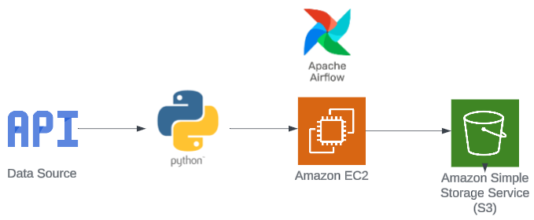

#

This project was made to try Apache Airflow, where I explored it and make a DAG with 4 tasks.
The core idea and steps were from [Darshil Parmer's video](https://youtu.be/q8q3OFFfY6c?si=vytpDNvAiiW4JLn-)

It needs:
- EC2 
- Install dependenciess
